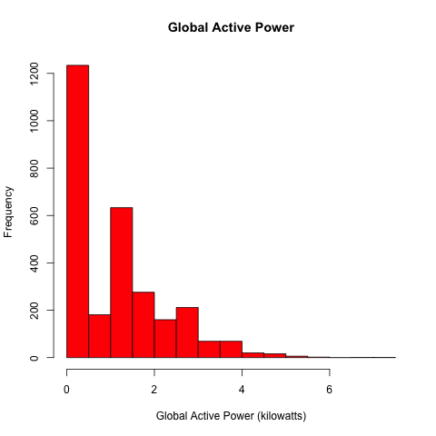
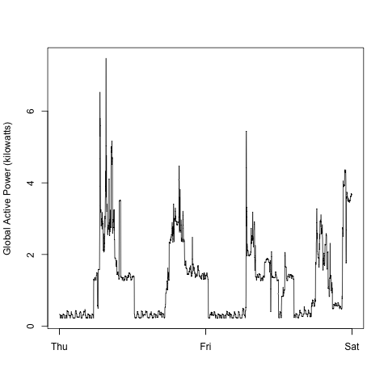
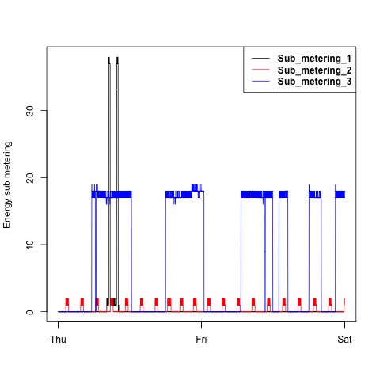
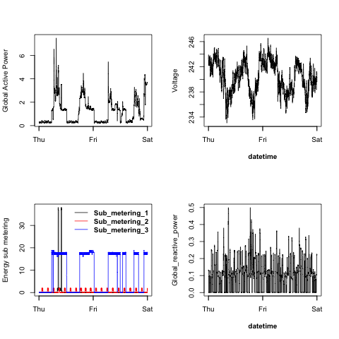

# Read me

## Introduction

This assignment uses data from the <a href="http://archive.ics.uci.edu/ml/"UC Irvine Machine Learning Repository</a>, a popular repository for machine learning datasets. In particular, we will be using the "Individual household electric power consumption Data Set" which I have made available on the course web site:

-   <b>Dataset</b>: <a href="https://d396qusza40orc.cloudfront.net/exdata%2Fdata%2Fhousehold_power_consumption.zip"Electric power consumption</a> [20Mb]

-   <b>Description</b>: Measurements of electric power consumption in one household with a one-minute sampling rate over a period of almost 4 years. Different electrical quantities and some sub-metering values are available.

The following descriptions of the 9 variables in the dataset are taken from the <a href="https://archive.ics.uci.edu/ml/datasets/Individual+household+electric+power+consumption"UCI web site</a>:

<ol>

<li><b>Date</b>: Date in format dd/mm/yyyy</li>

<li><b>Time</b>: time in format hh:mm:ss</li>

<li><b>Global_active_power</b>: household global minute-averaged active power (in kilowatt)</li>

<li><b>Global_reactive_power</b>: household global minute-averaged reactive power (in kilowatt)</li>

<li><b>Voltage</b>: minute-averaged voltage (in volt)</li>

<li><b>Global_intensity</b>: household global minute-averaged current intensity (in ampere)</li>

<li><b>Sub_metering_1</b>: energy sub-metering No. 1 (in watt-hour of active energy). It corresponds to the kitchen, containing mainly a dishwasher, an oven and a microwave (hot plates are not electric but gas powered).</li>

<li><b>Sub_metering_2</b>: energy sub-metering No. 2 (in watt-hour of active energy). It corresponds to the laundry room, containing a washing-machine, a tumble-drier, a refrigerator and a light.</li>

<li><b>Sub_metering_3</b>: energy sub-metering No. 3 (in watt-hour of active energy). It corresponds to an electric water-heater and an air-conditioner.</li>

</ol>

## Installation instructions:

-   Create R project

-   Create sub directory "Data" to contain the data file above

-   Create sub directory "Plots" to store the plots that the scripts are creating

-   Run Plot1.R to Plot4.R to create the respective plots

## My Results (including limited notes on the challenges)

## Data processing

-   Create new column to combine Date & Time column and covert the result to a date_time variable using strptime()

-   Converted Date column from character to Date in order to filter the 2 required dates (2007-02-01 and 2007-02-02) using as.Date()

-   Converted data for character to numeric where needed

### Plot 1

Remarks:

-   Specific settings: red for the bars

-   Title added

### Plot 2

Remarks:

-   To create this plot the main challenge was to combine Date and Time columns to create a new column for date_time.

-   X axis = datetime column

### Plot 3

Remarks:

-   Empty plot create using datetime as x axis and Sub_metering_1 as y axis to get the right sized y axis.

-   3 series created

-   Legend with bold text (text.font = 2), lines (lty = 1)

### Plot 4

Remarks:

-   Upper left is the same as plot 2 with a slightly different Y label text

-   Lower left is the same as plot 3 with adjustments to the legend. This legend has no border (bty = n) and the scaling of the text was a challenge to avoid it overlapping with the plot (used cex = 1 to solve this)

-   Upper right is a new plot. X label is **bold** while the other text remained default

-   Lower right is a new plot. X label is **bold** while the other text remained default, Y label is 'hard coded' to get the right result
